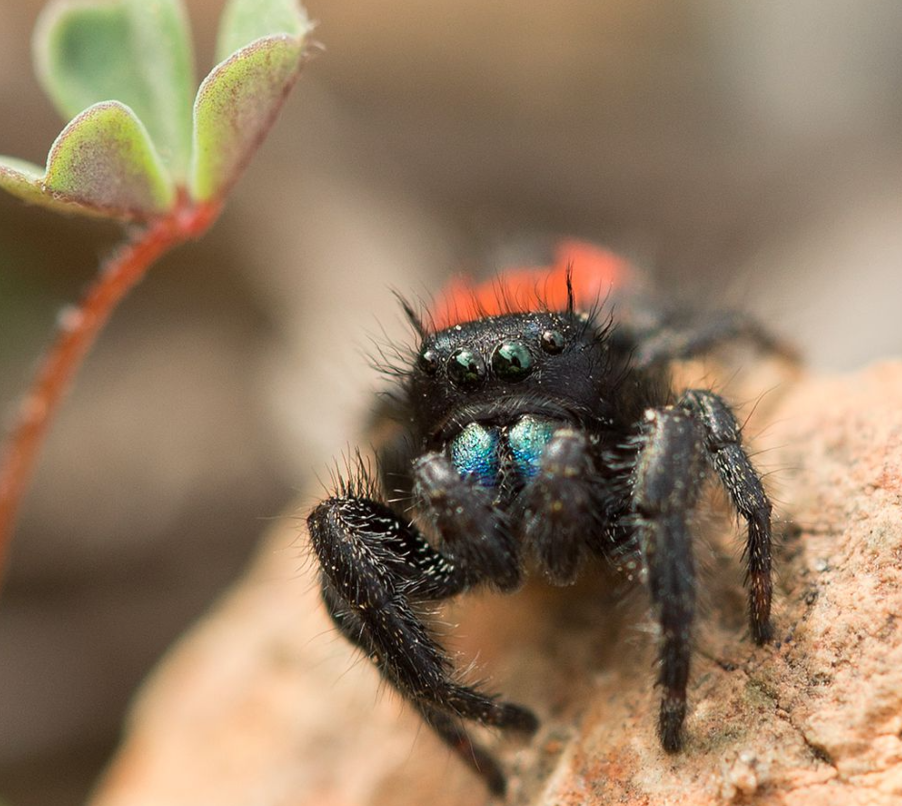

# Introduction to niche modeling

Thank you @jcoliver for most of the [code](https://github.com/jcoliver/biodiversity-sdm-lesson) in this repository.

[*Phidippus johnsoni* (Peckham & Peckham, 1883)](https://www.gbif.org/occurrence/3456688654)
observed in United States of America
 by Rachel Romine (licensed under http://creativecommons.org/licenses/by-nc/4.0/)

